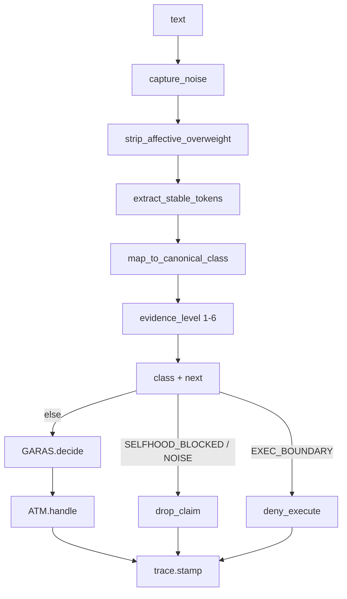

# A4B architecture

```mermaid
flowchart TD
  IN[text] --> CAP[capture_noise]
  CAP --> STRIP[strip_affective_overweight]
  STRIP --> TOK[extract_stable_tokens]
  TOK --> MAP[map_to_canonical_class]
  MAP --> LVL[evidence_level 1-6]
  LVL --> OUT[class + next]
  OUT -->|SELFHOOD_BLOCKED / NOISE| DROP[drop_claim]
  OUT -->|EXEC_BOUNDARY| DENY[deny_execute]
  OUT -->|else| GARAS[GARAS.decide]
  GARAS --> ATM[ATM.handle]
  ATM --> STAMP[trace.stamp]
  DROP --> STAMP
  DENY --> STAMP
```

GROK box is internal routing. Not xAI. src/a4b.py implements MAP+LVL+OUT.
