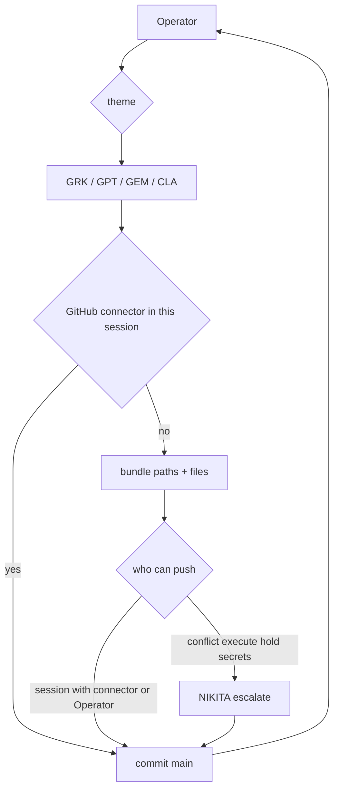

# Actor flowchart

Label ≠ path. Write vs bundle is decided by whether that session has a GitHub connector.

GEM: no connector observed. CLA: no connector in the last bundle. This Grok chat session: connector present.
NIKITA only on escalate.
