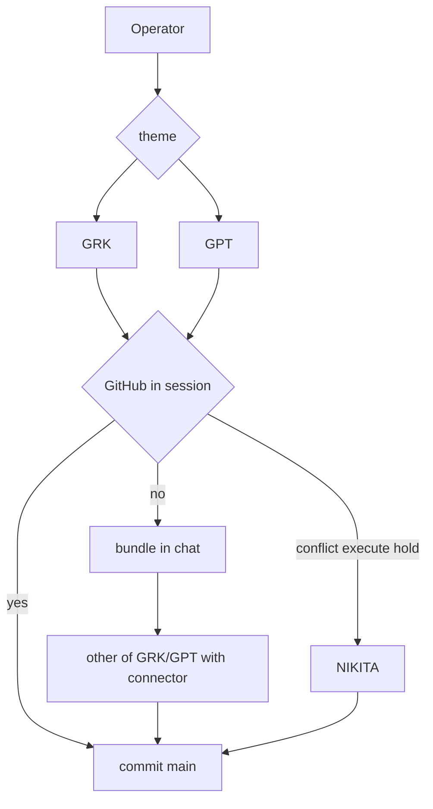

# Actor flowchart

CLA GEM out. Drive not used.

```mermaid
flowchart TD
  OP[Operator] --> Q{theme}
  Q --> GRK[GRK]
  Q --> GPT[GPT]
  GRK --> C{GitHub in session}
  GPT --> C
  C -->|yes| GIT[commit main]
  C -->|no| B[bundle in chat]
  B --> W[other of GRK/GPT with connector]
  W --> GIT
  C -->|conflict execute hold| NIK[NIKITA]
  NIK --> GIT
```
