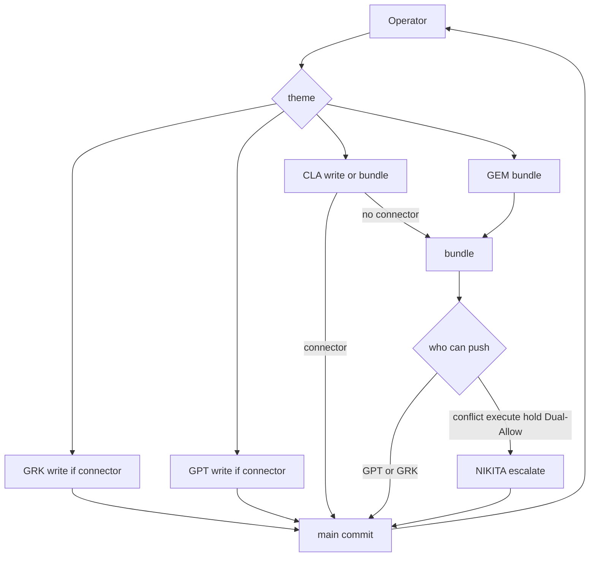

# Actor flowchart

Daily ring does not include NIKITA.

```mermaid
flowchart TD
  OP[Operator] --> Q{theme}
  Q --> GRK[GRK write if connector]
  Q --> GPT[GPT write if connector]
  Q --> GEM[GEM bundle]
  Q --> CLA[CLA write or bundle]
  GRK --> GIT[main commit]
  GPT --> GIT
  CLA -->|connector| GIT
  CLA -->|no connector| B[bundle]
  GEM --> B
  B --> W{who can push}
  W -->|GPT or GRK| GIT
  W -->|conflict execute hold Dual-Allow| NIK[NIKITA escalate]
  GIT --> OP
  NIK --> GIT
```

NIKITA only: apply when no writer is online, file conflict, execute/hold/secrets, Unklar=Stopp.
